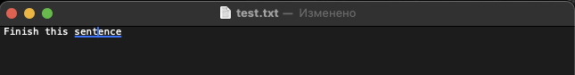

# ghost-ime

A small macOS input method that shows ghost-text suggestions while you type (English only, local-only).



## Quick start

```bash
./scripts/build.sh
./scripts/install.sh
```

Enable it:

1. System Settings -> Keyboard -> Input Sources
2. Add `ghost-ime`
3. Switch to it from the input menu

If it doesn't show up, log out and back in.

## Local neural autocomplete (Ollama)

`ghost-ime` can ask a local LLM (running on your Mac) for word completions.

```bash
ollama pull llama3.2:1b
./scripts/setup-local-ai.sh llama3.2:1b
./scripts/build.sh
./scripts/install.sh
```

By default, `ghost-ime` calls `http://127.0.0.1:11434/api/generate`.
If Ollama is unavailable, it falls back to local dictionary suggestions.

## Use

- Type letters -> a light gray suggestion appears
- Accept suggestion: `Tab` or `Right Arrow`
- Commit word: `Space` or `Return`
- Cancel composition: `Esc`

## Notes

- Works in most apps, but not in secure fields (passwords) and some custom editors.
- Learns locally. Data is stored at `~/Library/Application Support/ghost-ime/user_counts.json`.

## Uninstall

```bash
./scripts/uninstall.sh
```

---

# ghost-ime (Ru)

Метод ввода для macOS с автодополнением (только на английском, все локально).

## Quick start

```bash
./scripts/build.sh
./scripts/install.sh
```

Enable it:

1. System Settings -> Keyboard -> Input Sources
2. Добавьте `ghost-ime`
3. Переключайтесь на добавленную раскладку через меню ввода

Если метод ввода не появился, выйдите из сессии и войдите снова.

## Использование

- Печатаете буквы -> появляется серое продолжение
- Принять подсказку: `Tab` или `Right Arrow`
- Завершить слово: `Space` или `Return`
- Отменить: `Esc`

## Примечания

- Работает в большинстве приложений, но не в защищенных полях (пароли) и некоторых редакторах.
- Все хранится локально: `~/Library/Application Support/ghost-ime/user_counts.json`.

## Локальная нейросетевая подсказка (Ollama)

`ghost-ime` может брать продолжение слова из локальной LLM (без облака, на вашем Mac).

```bash
ollama pull llama3.2:1b
./scripts/setup-local-ai.sh llama3.2:1b
./scripts/build.sh
./scripts/install.sh
```

По умолчанию используется `http://127.0.0.1:11434/api/generate`.
Если Ollama недоступен, `ghost-ime` автоматически вернется к локальному словарю.

## Удаление

```bash
./scripts/uninstall.sh
```
